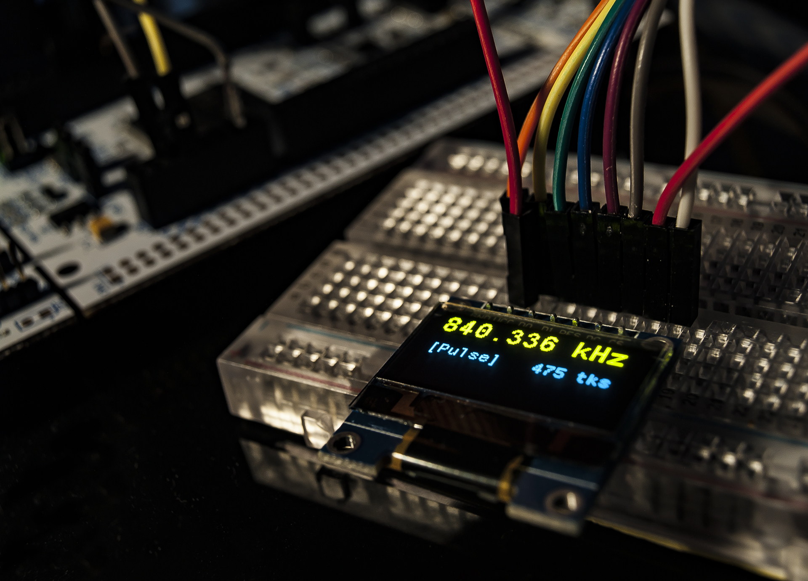

# stm32h7-freqcounter
A frequency counter for the NUCLEO-STM32H743

## Usage details
- UART: 8N1, 115200 baud/s
- Processor frequency: 400 MHz
- Measurement resolution (theoretical): 2.5ns

## Pinout
- `PD8` --> USART3_TX (default for Nucleo)
- `PC10` (opposite of NRST) --> **counter input**

#### OLED pinout (optional)
Tested OLED: SSD1306 (4-wire SPI)
- `3.3V` --> `VCC`
- `GND` --> `GND`
- `PB3` (opposite of D10) --> `SCK`/`D0`
- `PB5` (opposite of D11) --> `MOSI`/`D1`
- `PF12` (D8) --> `RES`ET
- `PD15` (D9) --> `DC` (Data/Command)
- `PB12` (opposite of GND) --> `CS`/`NSS` (Negative Slave Select)

#### Sample output
- `PC9` (opposite of IOREF) --> 200 MHz (`MCO` - Master Clock Output)

#### Nucleo pinout
https://www.st.com/content/ccc/resource/technical/document/user_manual/group0/26/49/90/2e/33/0d/4a/da/DM00244518/files/DM00244518.pdf/jcr:content/translations/en.DM00244518.pdf,
page 33
